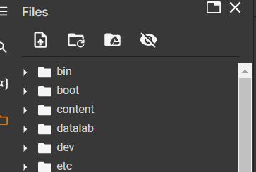

# Traffic-Sign-Image-Recognition

- Student 1: Minh Hoang Nguyen - s3712611

- Student 2: Ngoc Bao Vy Le -  s3828276

Notebook "Traffic_Sign_Image_Recognition.ipynb" is requried to be run on Google Colab as the code was designed to work on this specific platform (can also be run on local machine but need to alter the folder path).

Step 1: Clone the repository

Step 2: Upload the .ipynb file to Google Colab

Step 3: Upload the 2 dataset zip file to Colab root folder (make sure to upload the zip file because Colab will unzip these folder) 

Step 4: Can run section "Importing Library" and "Set Up Google Colab Working Environment"

To avoid runtime error on Colab, please mount your drive to the notebook so neccessary model can be saved when finish running. 
The code below will mount your drive to the notebook and create a folder named "COSC2673_2110" on your drive.

Step 5: Make sure these 2 parameters are set to True if first time running runtime

Step 6: You should be set to run all from this step on ward. If the file is crashed can refer to the final version of notebook available on this Repo as this is the lastest version or contact authors. 

Thank you !

